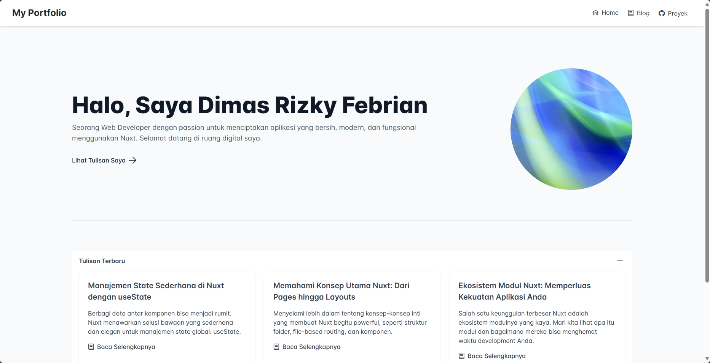

# Portofolio & Blog Pribadi dengan Nuxt

Ini adalah proyek "Hello World!" versi powerful yang saya bangun untuk mempelajari dan mendalami framework Nuxt. Proyek ini berupa situs portofolio pribadi yang juga berfungsi sebagai blog, di mana semua konten artikel diambil dari file Markdown lokal.

Proyek ini dibangun dari awal dengan panduan langkah demi langkah, mencakup berbagai rintangan teknis dan solusinya, mulai dari masalah lingkungan development hingga integrasi library UI.



---

## ✨ Fitur & Konsep yang Dipelajari

Proyek ini mengimplementasikan berbagai konsep inti dan modern dari Nuxt:

- **Struktur Proyek Fundamental**: Memahami kegunaan folder `pages`, `components`, dan `layouts`.
- **File-Based Routing**: Membuat rute dan halaman secara otomatis hanya dengan membuat file `.vue`.
- **Server Routes (API)**: Membangun API backend sendiri di dalam Nuxt menggunakan folder `server/api/` untuk membaca file Markdown secara manual dari server.
- **Data Fetching**: Menggunakan `useFetch` untuk mengambil data dari API endpoint internal.
- **Dynamic Routes**: Membuat halaman detail yang dinamis untuk setiap artikel (contoh: `/blog/[slug]`).
- **Komponen & Props**: Membuat komponen yang dapat digunakan kembali seperti `ArticleCard` (sebelum diganti PrimeVue).
- **Integrasi UI Library**: Berhasil mengintegrasikan **PrimeVue** ke dalam proyek Nuxt, termasuk:
  - Konfigurasi modul `nuxt-primevue`.
  - Menggunakan komponen seperti `Menubar`, `Button`, `Avatar`, `Card`, `Panel`, dan `Breadcrumb`.
  - Mengatasi masalah kompatibilitas versi dan styling.
- **Styling dengan Tailwind CSS**: Menggunakan Tailwind CSS untuk styling modern dan cepat, termasuk penggunaan `@apply` di dalam komponen Vue.
- **Animasi & Transisi**: Mengimplementasikan transisi antar halaman (`pageTransition`) global menggunakan CSS untuk memberikan pengalaman pengguna yang lebih halus.
- **SEO & Meta Tags**: Mengelola `<title>` dan `<meta>` tags secara dinamis di setiap halaman menggunakan `useHead`.
- **Problem Solving**: Melakukan debugging intensif terkait masalah lingkungan, dependensi, dan kompatibilitas versi.

---

## 🛠️ Teknologi yang Digunakan

- **Framework**: [Nuxt](https://nuxt.com/)
- **UI Library**: [PrimeVue](https://primevue.org/)
- **CSS Framework**: [Tailwind CSS](https://tailwindcss.com/)
- **Konten**: File Markdown lokal dibaca oleh API internal.
- **Icons**: [PrimeIcons](https://primeflex.org/primeicons)

---

## 🚀 Setup & Instalasi Lokal

Untuk menjalankan proyek ini di komputer lokal Anda, ikuti langkah-langkah berikut:

1.  **Clone repositori ini:**

    ```bash
    git clone https://github.com/dimasrizkyfebrian/nuxt-portfolio-blog.git
    ```

2.  **Masuk ke direktori proyek:**

    ```bash
    cd nuxt-portfolio-blog
    ```

3.  **Install semua dependensi:**

    ```bash
    npm install
    ```

4.  **Jalankan server development:**

    ```bash
    npm run dev
    ```

5.  Buka [http://localhost:3000](http://localhost:3000) di browser Anda.

### Perintah Berguna Lainnya

- **Build untuk produksi (SSR):**

  ```bash
  npm run build
  ```

- **Generate situs statis (SSG):**
  ```bash
  npm run generate
  ```
